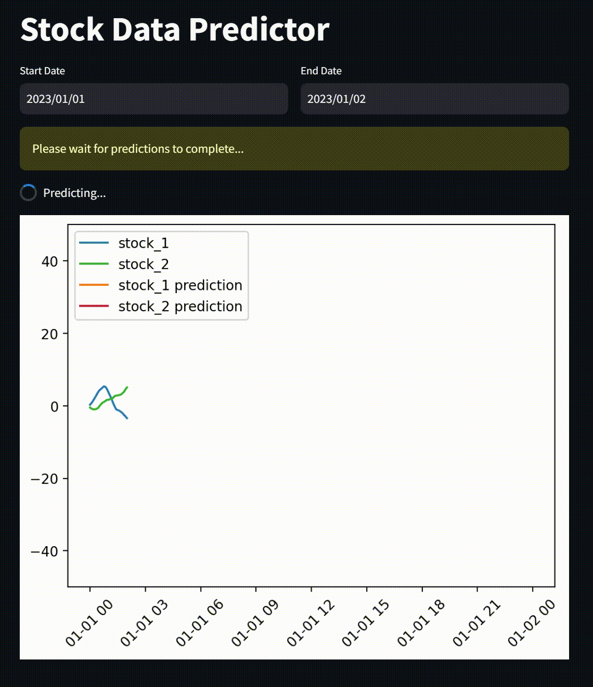

# Anomaly Detection (for Production)

Model generated and training using the notebook [Anomaly Detection](./anomaly_detection.ipynb).

Assuming `stock_data_generator` used, the model is saved in the directory `model`, which is also provided. When using docker compose this model is loaded into the `fastapi` container which serves this model and uses the same class of the Neural network model to initialize.

The Streamlit container, simply generates a new dataset from `stock_data_generator` and performs prediction using a time window of 24, which was used in the original model.

### Note
Simply run `docker-compose up --build` if you wan to use the default model in this repo.